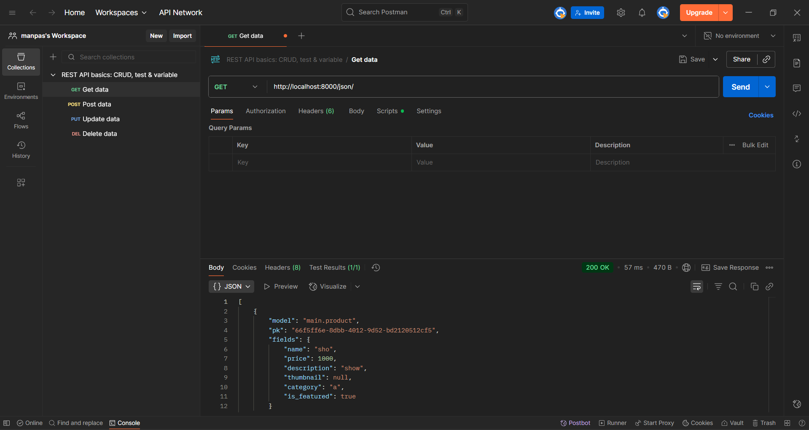
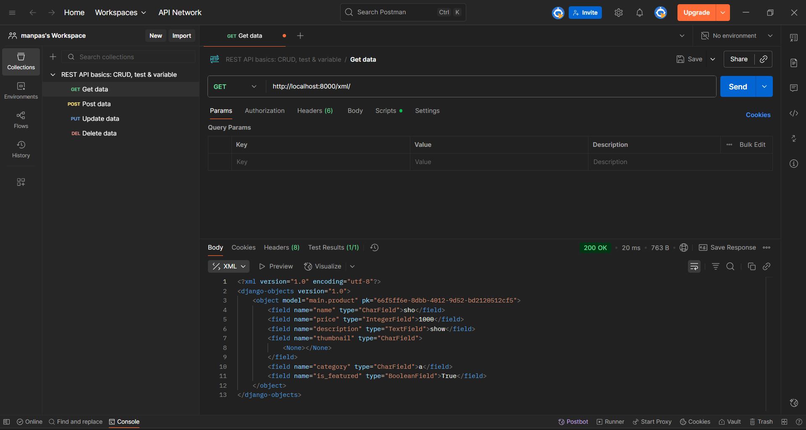
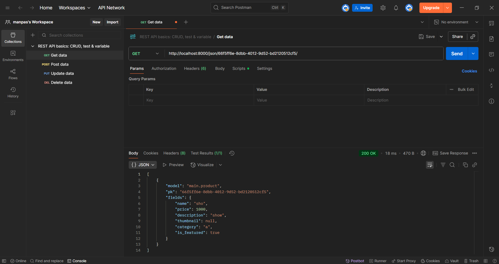
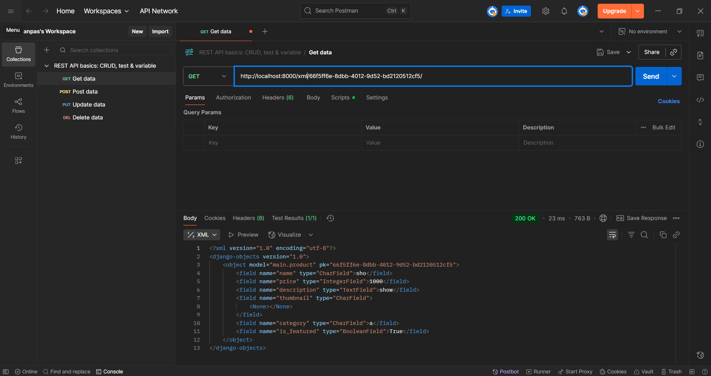

Nama : Muhammad Fadhlurrohman Pasya

NPM : 2406411830

Kelas : PBP E

Tugas 2

1. Pertama, saya coba mengetes bagian mana saja yang perlu dan dengan urutan bagaimana (gagal)
percobaan kedua mengikuti tutorial, tapi memperhatikan bagian-bagian mana yang saya perlu ganti. seperti contohnya, schemanya yang merupakan tugas individu, dan models yang diganti dari news menjadi product
mungkin akan coba lagi dengan lebih sedikit melihat tutorial nanti (tugas 3?)
btw main saya tulis sendiri tampa nyontek tutorial karena saya pernah membuat kode html sbelumnya (satu kali)
2. client merequest dengan suatu url yang di cek di urls.py yang menjalankan views di views.py yang menggunakan template yang ditulis di file html. dari situ akan melakukan hal-hal data dengan data yang di atur di model.html
3. setting.py penting karena settings menyimpan segala setting konfigurasi yang diterapkan
4. dari data model yang telah diubah, kta lalu membuat migration file yang djnago proses. nanti ada python file yang berisi perubahannya.
Lalu, saat kta migrate, django melihat file file yang di migration lalu di aplikasikan.
5. karena mengggunakan python, sehingga mudah
6. tidak ada yang major, gpp gpp aja sejauh ini

Tugas 3

1. Supaya data-data relevan yg ada di server bisa dilihat klien
2. Karena json lebih mudah dibaca dari xml
3. Guna is_valid() adalah untuk mengecek apakah form-nya valid atau tidak. Ini diperlukan supaya tidak ada input salah yang diproses
4. Guna csrf_token secara otomatis di generate django untuk security dari serangan csrf (Cross-Site Request Forgey). Jika tidak ada csrf_token, penyerang bisa mengubah data (seperti mengubah password atau melakukan pembelian) atas nama user.
5. Seperti sebelumnya, saya pertama menyontek tutorial. Tapi ternyata banyak hal yang perluh diubah kali ini (lebih banyak dari sebelumnya). Terutama di bagian yang saya tidak tambahkan/saya ubah di tugas 2. Contoh yang paling obvious adalah nama model yang sebelumnya News, saya ubah jadi Product. Juga ada news jadi item. Dan favorit saya, news_item jadi item_thing.
Juga betulin easter egg, sama ternyata perluh id (saya tidak sertakan di tugas 2)
Juga yang ditunjukkan diubah dari hal relevan di news (seperti view count dll) saya ubah jadi hal yang relevan di shop (seperti price dll)

Tugas 4

1. AuthehtificationForm adalah form yang berguna untuk meloginkan user
keuntungannya termasuk keamanan django, dan mudah diimplementasikan
kekurangannya adalah kesulitan untuk mengustonya
2. Autentifikasi adalah pengecekkan identitas, dan otorisasi adalah penentuan akses.
Django mengautentifikasi dengan session dan cookies. django memiliki user model yang berisi 'model identitas' user, menggunakan backend untuk mengautentifiksaisi, dan menggunakan middleware untuk mengatur data
django mengotorisasi dengan kombinasi perizinan, backend autentifikasi, dan dekorator yang mengatur siapa siapa yang bisa melihat dan mengubah data. Termasuk perizinan level 'model' yang dipunyai user dan decorator seperti @login_required
3. Cookie mempunyai expiration yang bisa session based atau permanen, otentikasi yang aman, bisa di share sesama subdomain, dan lebih aman dari serangan
Session storage mempunyai expiration ketika tab atau laman ditutup, tidak perluh dikirim lagi ke server, tapi rentan dalam menyimpan data sensitif karena lebih mudah di hack
4. Cookie, meski lebih aman dari session storage, masih mempunyai beberapa kerentanan, seperti pembajakan sesi, serangan XSS, dan serangan CSRF
5. Lowkey forgetting futbal shop isn't supposed to have proper spelling so I changed some words to have the wrong spelling. That's the first thing I did before even opening the tutorial guide
Lalu setelah itu saya lanjut membuat sesuai yang ada di tutorial. Somehow, lebih banyak yang sama dengan tutorial dibanding tugas 3. Meski lebih banyak yang ditambahkan di tugas 4 juga.
Jadi setelah pembuatan, ada sesi bugfixing yang saya lakukan yang ternyata terjadi karena saat pengubahan nama dari terminologi news jadi shop, saya salah mengetik banyak.
Hal lain yang diubah seperti init return self.name bukan self.title
Juga di akhir ada pembuatan template. Aslinya saya bingung mau bagaimana cara untuk mengimplementasikannya, dengan clue hebat yang saya dapat dari demo, bahwa bisa langsung saja buat user tanpa register.
Jadi saya menaruhnya di show_main(), tapi, error kalau sudah dibuat si Minoru dan Budinya, jadi dibuat if not yg itulah sudah exist atau belum

Tugas 5
1. Specifity Selector urutannya:
   Inline Styles>
   ID Selectors>
   Classes Selector>
   Element Selector
2. Responsive design penting karena tidak semua perangkat memiliki Ukuran layar yang sama. Kalau misalnya website tidak memiliki responsive design, maka pengguna yang tidak mempunyai layar yang pas tidak akan merasakan pengalaman menggunakan web dengan nyaman. Contoh unresponsive design adalah website-website yang tidak mobile friendly
3. Margin adalah bagian diluar elemen, border merupakan bagian di tepi elemen, dan padding adalah jarak dari border ke isi/konten dari elemen
   Di tailwind:
   Margin di atur dengan m (m-<number>, mx-<number>, mt-<number>, dll)
   Border dengan border (border, border-<number>, border-[<value>], dll)
   Padding dengan p (p-<number>, px-<number>, pt-<number>, dll)
4. flexbox adalah cara untuk mengatur elemen biar terderet tanpa mengatur manual posisnya. Flexbox adalah untuk mengatur elemen dalam satu dimensi, semacam list, sedangkan grid untuk dua dimensi, semacam grid
5. >Pertama, saya lihat cara edit delete (gk ngaruh, gk bakal diubah juga), lalu saya membaca website tailwind maksudnya apaan
>kebanyakan, kewalahan, coba aja. Jelek.
>Ambil template, ubah sesuai selera (dengan liat website yg sebeliumnya dibaca)
>bisa 👍
>Pas diupload ke pws malah rusak :(
>Sedih
>kak ini gimana benerinnya